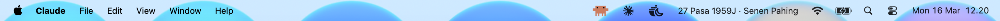

# 2x Claude Usage Menu Bar App

A lightweight macOS menu bar app that shows when Claude's **2x bonus usage** is active.



## About the Promotion

From **March 13 through March 27, 2026 (11:59 PM PT)**, Anthropic is doubling Claude usage during off-peak hours as a thank you to users.

> Source: [@claudeai on X](https://x.com/claudeai/status/2032911276226257206) | [Claude Support Article](https://support.claude.com/en/articles/14063676-claude-march-2026-usage-promotion)

### Schedule

| Time | Status |
|------|--------|
| Weekdays 5:00–11:00 AM PT (8:00 AM–2:00 PM ET / 12:00–6:00 PM GMT) | **Peak** — normal usage |
| Weekdays outside peak hours | **2x usage** |
| Weekends (all day Saturday & Sunday) | **2x usage** |

### Eligible Plans

Free, Pro, Max, and Team plans. Enterprise plans are **excluded**.

### Where It Applies

Claude (web, desktop, mobile), Cowork, Claude Code, Claude for Excel, and Claude for PowerPoint.

### Important Notes

- The bonus usage during off-peak hours does **not** count toward weekly usage limits
- No action required — the 2x usage applies automatically
- Cannot be combined with other promotional offers
- After March 27, usage limits revert to normal with no billing changes

## How the App Works

The app places a `mascot.png` icon in the macOS menu bar:

- **Full color mascot** → 2x bonus usage is active
- **Dimmed/grayscale mascot** → peak hours (normal usage)

Click the icon to see:
- Current status (`🟢 2× Claude` or `⚪ Claude peak`)
- PT time
- Countdown to next status change
- Launch at Login toggle

The app refreshes every 60 seconds to keep the status current.

## Requirements

- macOS 14.0 (Sonoma) or later
- Swift 5.9+

## Build & Run

```bash
swift build
swift run Claude2xUsage
```

Or open in Xcode:

```bash
open Package.swift
```

## Project Structure

```
├── Package.swift
├── mascot.png                          # Menu bar icon
└── Sources/Claude2xUsage/
    ├── Claude2xApp.swift               # App entry, menu bar UI, mascot rendering
    ├── UsageStatus.swift               # Time zone logic & status calculation
    └── Info.plist                       # LSUIElement (hides Dock icon)
```

## License

MIT
